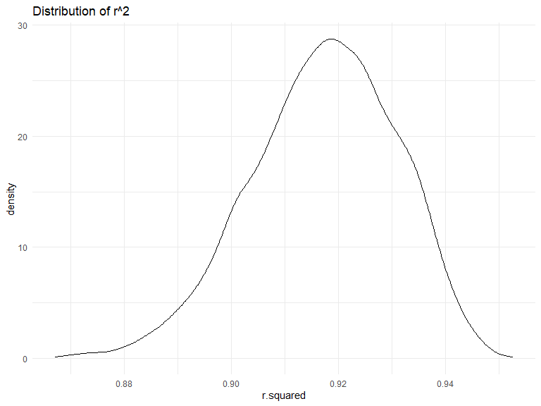
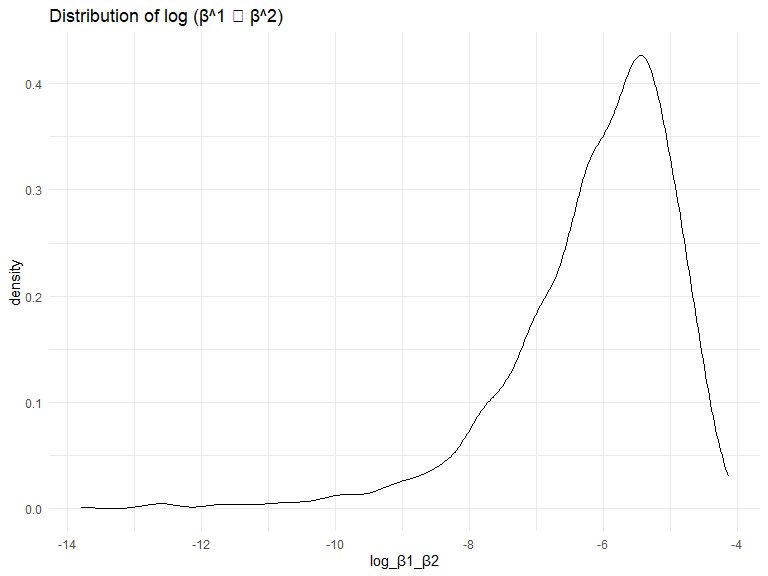
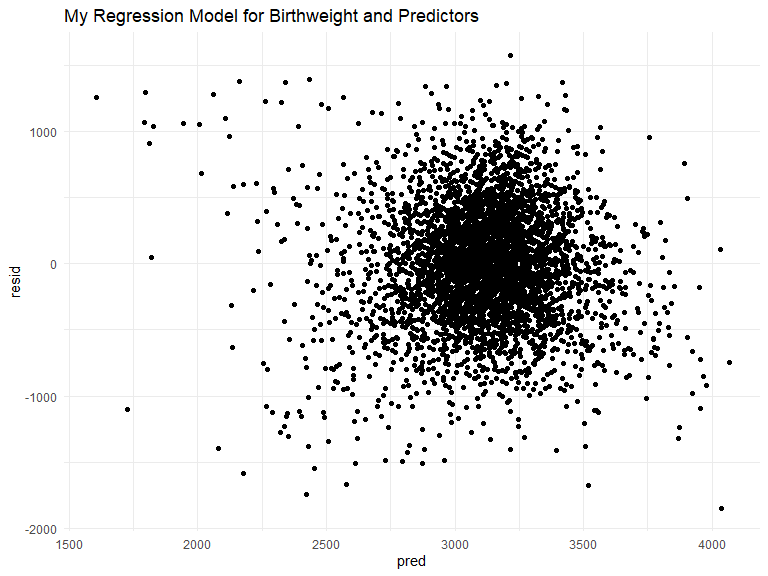
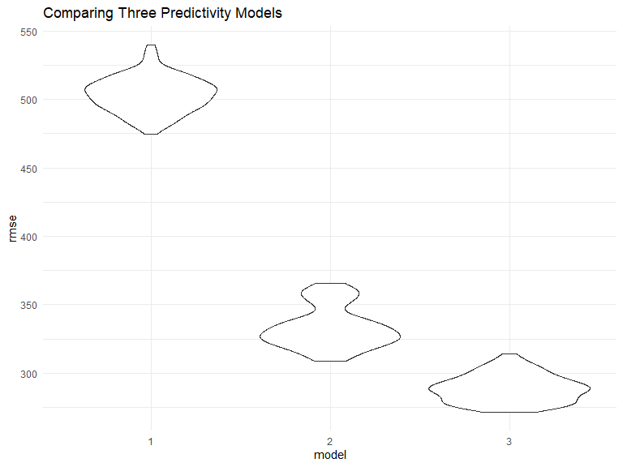

p8105_hw6_yw3995
================
Yuxuan Wang
2023-12-02

## Problem 1

In the data cleaning code below we create a `city_state` variable,
change `victim_age` to numeric, modifiy victim_race to have categories
white and non-white, with white as the reference category, and create a
`resolution` variable indicating whether the homicide is solved. Lastly,
we filtered out the following cities: Tulsa, AL; Dallas, TX; Phoenix,
AZ; and Kansas City, MO; and we retained only the variables
`city_state`, `resolution`, `victim_age`, `victim_sex`, and
`victim_race`.

``` r
homicide_df = 
  read_csv("data/homicide-data.csv", na = c("", "NA", "Unknown")) |> 
  mutate(
    city_state = str_c(city, state, sep = ", "),
    victim_age = as.numeric(victim_age),
    resolution = case_when(
      disposition == "Closed without arrest" ~ 0,
      disposition == "Open/No arrest"        ~ 0,
      disposition == "Closed by arrest"      ~ 1)
  ) |> 
  filter(victim_race %in% c("White", "Black")) |> 
  filter(!(city_state %in% c("Tulsa, AL", "Dallas, TX", "Phoenix, AZ", "Kansas City, MO"))) |> 
  select(city_state, resolution, victim_age, victim_sex, victim_race)
```

Next we fit a logistic regression model using only data from Baltimore,
MD. We model `resolved` as the outcome and `victim_age`, `victim_sex`,
and `victim_race` as predictors. We save the output as `baltimore_glm`
so that we can apply `broom::tidy` to this object and obtain the
estimate and confidence interval of the adjusted odds ratio for solving
homicides comparing non-white victims to white victims.

``` r
baltimore_glm = 
  filter(homicide_df, city_state == "Baltimore, MD") |> 
  glm(resolution ~ victim_age + victim_sex + victim_race, family = binomial(), data = _)

baltimore_glm |> 
  broom::tidy() |> 
  mutate(
    OR = exp(estimate), 
    OR_CI_upper = exp(estimate + 1.96 * std.error),
    OR_CI_lower = exp(estimate - 1.96 * std.error)) |> 
  filter(term == "victim_sexMale") |> 
  select(OR, OR_CI_lower, OR_CI_upper) |>
  knitr::kable(digits = 3)
```

|    OR | OR_CI_lower | OR_CI_upper |
|------:|------------:|------------:|
| 0.426 |       0.325 |       0.558 |

Below, by incorporating `nest()`, `map()`, and `unnest()` into the
preceding Baltimore-specific code, we fit a model for each of the
cities, and extract the adjusted odds ratio (and CI) for solving
homicides comparing non-white victims to white victims. We show the
first 5 rows of the resulting dataframe of model results.

``` r
model_results = 
  homicide_df |> 
  nest(data = -city_state) |> 
  mutate(
    models = map(data, \(df) glm(resolution ~ victim_age + victim_sex + victim_race, 
                             family = binomial(), data = df)),
    tidy_models = map(models, broom::tidy)) |> 
  select(-models, -data) |> 
  unnest(cols = tidy_models) |> 
  mutate(
    OR = exp(estimate), 
    OR_CI_upper = exp(estimate + 1.96 * std.error),
    OR_CI_lower = exp(estimate - 1.96 * std.error)) |> 
  filter(term == "victim_sexMale") |> 
  select(city_state, OR, OR_CI_lower, OR_CI_upper)

model_results |>
  slice(1:5) |> 
  knitr::kable(digits = 3)
```

| city_state      |    OR | OR_CI_lower | OR_CI_upper |
|:----------------|------:|------------:|------------:|
| Albuquerque, NM | 1.767 |       0.831 |       3.761 |
| Atlanta, GA     | 1.000 |       0.684 |       1.463 |
| Baltimore, MD   | 0.426 |       0.325 |       0.558 |
| Baton Rouge, LA | 0.381 |       0.209 |       0.695 |
| Birmingham, AL  | 0.870 |       0.574 |       1.318 |

Below we generate a plot of the estimated ORs and CIs for each city,
ordered by magnitude of the OR from smallest to largest. From this plot
we see that most cities have odds ratios that are smaller than 1,
suggesting that crimes with male victims have smaller odds of resolution
compared to crimes with female victims after adjusting for victim age
and race. This disparity is strongest in New yrok. In roughly half of
these cities, confidence intervals are narrow and do not contain 1,
suggesting a significant difference in resolution rates by sex after
adjustment for victim age and race.

``` r
model_results |> 
  mutate(city_state = fct_reorder(city_state, OR)) |> 
  ggplot(aes(x = city_state, y = OR)) + 
  geom_point() + 
  geom_errorbar(aes(ymin = OR_CI_lower, ymax = OR_CI_upper)) + 
  theme(axis.text.x = element_text(angle = 90, hjust = 1))
```


## Problem 2

### Loading data

``` r
weather_df = 
  rnoaa::meteo_pull_monitors(
    c("USW00094728"),
    var = c("PRCP", "TMIN", "TMAX"), 
    date_min = "2022-01-01",
    date_max = "2022-12-31") |>
  mutate(
    name = recode(id, USW00094728 = "CentralPark_NY"),
    tmin = tmin / 10,
    tmax = tmax / 10) |>
  select(name, id, everything())
```

### The distribution of r^2

``` r
r_squared =
  weather_df |> 
  modelr::bootstrap(n = 5000) |> 
  mutate(
    models = map(strap, ~lm(tmax ~ tmin + prcp, data = .x)),
    results = map(models, broom::glance)) |> 
  select(-strap, -models) |> 
  unnest(results)

r_squared |> 
  ggplot(aes(x = r.squared)) + geom_density() +
  labs(title = "Distribution of r^2") +
  theme_minimal()
```



- The distribution of r^2 exhibits a left-skewed pattern, characterized
  by a notable concentration between 0.91 and 0.93, potentially
  attributable to the impact of outliers. The mean is typically less
  than the median in a left-skewed distribution, as the skewness is
  pulling the average towards the left tail. This implies a tendency
  towards higher r^2 values in the majority of bootstrap samples.

### The distribution of log (β^1 ∗ β^2)

``` r
beta = 
  weather_df |> 
  modelr::bootstrap(n = 5000) |> 
  mutate(
    models = map(strap, ~lm(tmax ~ tmin + prcp, data = .x)),
    results = map(models, broom::tidy)) |> 
  select(-strap, -models) |> 
  unnest(results) |> 
  select(.id, term, estimate) |> 
  pivot_wider(
    names_from = term, 
    values_from = estimate) |> 
  rename(beta1 = tmin, beta2 = prcp) |> 
  mutate(log_β1_β2 = log(beta1 * beta2))

beta |> 
  ggplot(aes(x = log_β1_β2)) + geom_density() +
  labs(title = "Distribution of log (β^1 ∗ β^2)") +
  theme_minimal()
```



- The distribution of log (β^1 ∗ β^2) is more left-skewed, displaying
  significant density between -6 and -5, likely influenced by outliers.
  The mean is typically less than the median in a left-skewed
  distribution, as the skewness is pulling the average towards the left
  tail. This suggests a prevalent occurrence of higher values in most
  bootstrap samples, although there are comparatively fewer instances of
  lower values.

### Provide a 95% confidence interval for r^2 and log(β<sup>0∗β</sup>1)

``` r
r_squared |> 
  summarize(
    ci_lower = quantile(r.squared, 0.025), 
    ci_upper = quantile(r.squared, 0.975))
```

    ## # A tibble: 1 × 2
    ##   ci_lower ci_upper
    ##      <dbl>    <dbl>
    ## 1    0.889    0.941

``` r
beta |> 
  summarize(
    ci_lower = quantile(log_β1_β2, 0.025, na.rm = TRUE), 
    ci_upper = quantile(log_β1_β2, 0.975, na.rm = TRUE))
```

    ## # A tibble: 1 × 2
    ##   ci_lower ci_upper
    ##      <dbl>    <dbl>
    ## 1    -9.23    -4.53

## Problem 3

### Load and clean the data

``` r
birthweight_df = 
  read_csv("./data/birthweight.csv") |> 
  mutate(babysex = as.factor(babysex),
         malform = as.factor(malform),
         mrace = as.factor(mrace),
         frace = as.factor(frace)
         ) |> 
  janitor::clean_names() |> 
  select(bwt, everything())

birthweight_df
```

    ## # A tibble: 4,342 × 20
    ##      bwt babysex bhead blength delwt fincome frace gaweeks malform menarche
    ##    <dbl> <fct>   <dbl>   <dbl> <dbl>   <dbl> <fct>   <dbl> <fct>      <dbl>
    ##  1  3629 2          34      51   177      35 1        39.9 0             13
    ##  2  3062 1          34      48   156      65 2        25.9 0             14
    ##  3  3345 2          36      50   148      85 1        39.9 0             12
    ##  4  3062 1          34      52   157      55 1        40   0             14
    ##  5  3374 2          34      52   156       5 1        41.6 0             13
    ##  6  3374 1          33      52   129      55 1        40.7 0             12
    ##  7  2523 2          33      46   126      96 2        40.3 0             14
    ##  8  2778 2          33      49   140       5 1        37.4 0             12
    ##  9  3515 1          36      52   146      85 1        40.3 0             11
    ## 10  3459 1          33      50   169      75 2        40.7 0             12
    ## # ℹ 4,332 more rows
    ## # ℹ 10 more variables: mheight <dbl>, momage <dbl>, mrace <fct>, parity <dbl>,
    ## #   pnumlbw <dbl>, pnumsga <dbl>, ppbmi <dbl>, ppwt <dbl>, smoken <dbl>,
    ## #   wtgain <dbl>

- I convert numeric to factor to clean the data for regression analysis.

### Check for missing

``` r
sum(is.na(birthweight_df))
```

    ## [1] 0

- There is no missing data.

### Propose a regression model for birthweight

``` r
all_model = lm(bwt ~ ., data = birthweight_df)
summary(all_model)
```

    ## 
    ## Call:
    ## lm(formula = bwt ~ ., data = birthweight_df)
    ## 
    ## Residuals:
    ##      Min       1Q   Median       3Q      Max 
    ## -1097.68  -184.86    -3.33   173.09  2344.15 
    ## 
    ## Coefficients: (3 not defined because of singularities)
    ##               Estimate Std. Error t value Pr(>|t|)    
    ## (Intercept) -6265.3914   660.4011  -9.487  < 2e-16 ***
    ## babysex2       28.7073     8.4652   3.391 0.000702 ***
    ## bhead         130.7781     3.4523  37.881  < 2e-16 ***
    ## blength        74.9536     2.0217  37.075  < 2e-16 ***
    ## delwt           4.1007     0.3948  10.386  < 2e-16 ***
    ## fincome         0.2898     0.1795   1.614 0.106551    
    ## frace2         14.3313    46.1501   0.311 0.756168    
    ## frace3         21.2361    69.2960   0.306 0.759273    
    ## frace4        -46.9962    44.6782  -1.052 0.292912    
    ## frace8          4.2969    74.0741   0.058 0.953745    
    ## gaweeks        11.5494     1.4654   7.882 4.06e-15 ***
    ## malform1        9.7650    70.6259   0.138 0.890039    
    ## menarche       -3.5508     2.8951  -1.226 0.220083    
    ## mheight         9.7874    10.3116   0.949 0.342588    
    ## momage          0.7593     1.2221   0.621 0.534418    
    ## mrace2       -151.4354    46.0453  -3.289 0.001014 ** 
    ## mrace3        -91.3866    71.9190  -1.271 0.203908    
    ## mrace4        -56.4787    45.1369  -1.251 0.210901    
    ## parity         95.5411    40.4793   2.360 0.018307 *  
    ## pnumlbw             NA         NA      NA       NA    
    ## pnumsga             NA         NA      NA       NA    
    ## ppbmi           4.3538    14.8913   0.292 0.770017    
    ## ppwt           -3.4716     2.6121  -1.329 0.183913    
    ## smoken         -4.8544     0.5871  -8.269  < 2e-16 ***
    ## wtgain              NA         NA      NA       NA    
    ## ---
    ## Signif. codes:  0 '***' 0.001 '**' 0.01 '*' 0.05 '.' 0.1 ' ' 1
    ## 
    ## Residual standard error: 272.5 on 4320 degrees of freedom
    ## Multiple R-squared:  0.7183, Adjusted R-squared:  0.717 
    ## F-statistic: 524.6 on 21 and 4320 DF,  p-value: < 2.2e-16

- After including all variables in the model, I observed several
  significant values, including *babysex2, bhead, blength, delwt,
  gaweeks, parity, and smoken*. Since I aim to construct a regression
  model to predict birthweight, variables such as babysex2, bhead, and
  blength, which pertain to post-birth characteristics, should be
  omitted. Consequently, the refined model will encompass **delwt,
  gaweeks, smoken, and parity** as predictors.

``` r
fit_model = lm(bwt ~ delwt + smoken + gaweeks + parity, data = birthweight_df)

birthweight_df |> 
  modelr::add_predictions(fit_model) |> 
  add_residuals(fit_model) |> 
  ggplot(aes(x = pred, y = resid)) +
  geom_point() +
  labs(title = "My Regression Model for Birthweight and Predictors") +
  theme_minimal()
```



- From this distribution we know **the residuals scatter around 0 with
  the predictions scatter around 3150**. This is a positive sign,
  suggesting that the model is capturing the overall trend in the data
  without a systematic tendency to overpredict or underpredict. However,
  the consistent offset in the predictions around 3150 suggests a need
  for further examination. This could be due to various reasons such as
  a missing predictor, a non-linear relationship, or a model
  misspecification.

### Compare my model to the others two

``` r
model_df = 
  crossv_mc(birthweight_df, 100) |> 
  mutate(
    train = map(train, as_tibble),
    test = map(test, as_tibble))

model_df =
  model_df |> 
  mutate(
    model_1  = map(train, ~lm(bwt ~ babysex + fincome + smoken, data = .x)),
    model_2  = map(train, ~lm(bwt ~ gaweeks + blength, data = .x)),
    model_3  = map(train, ~lm(bwt ~ bhead * blength * babysex, data = .x))) |> 
  mutate(
    rmse_1 = map2_dbl(model_1, test, \(mod, df) rmse(model = mod, data = df)),
    rmse_2 = map2_dbl(model_2, test, \(mod, df) rmse(model = mod, data = df)),
    rmse_3 = map2_dbl(model_3, test, \(mod, df) rmse(model = mod, data = df)))
```

### A plot

``` r
model_df |> 
  select(starts_with("rmse")) |> 
  pivot_longer(
    everything(),
    names_to = "model", 
    values_to = "rmse",
    names_prefix = "rmse_") |> 
  mutate(model = fct_inorder(model)) |> 
  ggplot(aes(x = model, y = rmse)) + geom_violin() +
  labs(title = "Comparing Three Predictivity Models") +
  theme_minimal()
```



- Upon comparing the prediction error distributions among three methods,
  it was observed that Model 3 exhibits the lowest mean Root Mean Square
  Error (RMSE), indicating superior predictive performance. In contrast,
  Model 1 (my model) demonstrates the highest RMSE. This discrepancy
  suggests that **Model 3 is a well-fitted model with strong
  predictivity**. Notably, Model 3 incorporates predictors such as head
  circumference, length, sex, and all interactions, including the
  three-way interaction between these variables.
